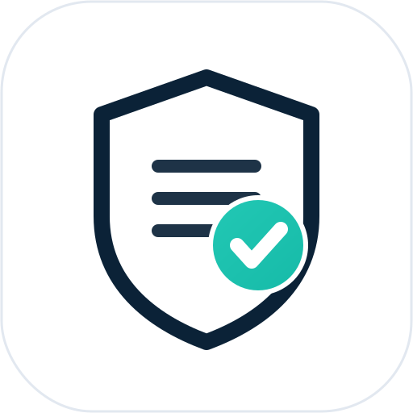

<div align="center">



# ClauseKeeper

### The open-source way to keep your website's legal documents current.

**Privacy Policy · Terms of Service · Cookie Policy · AI-Disclosure** — generated in minutes, and kept up to date as the law changes.

[](LICENSE)
[](docs/SELF_HOSTING.md)


[**🔎 Try the free scanner**](https://clausekeeper.app/scan) · [**🐳 Self-host in 2 minutes**](docs/SELF_HOSTING.md) · [**🤝 Contribute**](CONTRIBUTING.md)

⭐ **If this saves you a lawyer's invoice, drop a star — it genuinely helps.**

</div>

---

## What is ClauseKeeper?

Every website needs a Privacy Policy, Terms of Service, Cookie banner, and — as of 2026 — an **AI-disclosure** statement. The problem isn't *writing* them once. It's that **the law keeps moving**: the EU AI Act phases in, US states pass new privacy laws, and your "compliant" policy from last year is quietly stale.

ClauseKeeper does two things:

1. **🔎 Free compliance scanner** — paste your policy text or a URL, get a **0–100 score** and a checklist of missing or stale clauses (GDPR, CCPA/CPRA, cookies, retention, **AI disclosure**, COPPA, and more). 100% rule-based, **no LLM, $0 to run.**
2. **📄 Document generator** — answer a short form, get a Privacy Policy, ToS, Cookie Policy, and a 2026 AI-Disclosure addendum with conditional clauses for your jurisdictions.

> **It's a starting point, not legal advice.** ClauseKeeper gets you 90% of the way and keeps you current — for the edge cases, talk to a lawyer.

---

## 🆚 Open-source alternative to expensive compliance suites

The enterprise compliance platforms (Vanta, Drata, Delve, etc.) are built for funded startups closing SOC 2 / HIPAA enterprise deals — and priced accordingly (thousands per year, sales demos, audit-firm relationships).

**ClauseKeeper is the opposite end of the market:** self-serve, dirt-cheap, and open source. It's for the indie founder, freelancer, and small SaaS who just need their website's legal documents *correct and current* — without a sales call or an enterprise invoice.

| | Self-host (free) | Cloud (clausekeeper.app) |
|---|---|---|
| Free compliance scanner | ✅ | ✅ |
| Document generator | ✅ | ✅ |
| Hosted, versioned policy URLs | ✅ (your server) | ✅ |
| **Always-current** auto-updates when laws change | ⚙️ you maintain the clause rules | ✅ we maintain them for you |
| Billing / Stripe | n/a | ✅ |
| Maintenance | you | us |

If you self-host, **you own everything** — the scanner and generator run with zero external keys. The paid cloud tier exists for people who'd rather we keep the clause library current for them.

---

## 🐳 Self-host in 2 minutes

```bash
git clone https://github.com/<your-org>/ClauseKeeper.git
cd ClauseKeeper
cp .env.example .env          # defaults work out of the box; no paid keys needed
docker compose up
# open http://localhost:8000
```

The scanner and generator work immediately — **no Stripe, no API keys, nothing to sign up for.** Full guide: [docs/SELF_HOSTING.md](docs/SELF_HOSTING.md).

Prefer running it without Docker? See the [contributing guide](CONTRIBUTING.md) for the `uv` / `venv` dev setup.

---

## 🛠 Tech stack

- **FastAPI** + Uvicorn (Python 3.11)
- **SQLite** for persistence (zero-config; swap-friendly)
- **Jinja2** templates, no JS framework — fast and simple
- Rule-based clause engine (`app/clause_rules.py`) — **no LLM dependency** for the core product
- Optional **Stripe** for the hosted billing tier

---

## 🤝 Contributing

PRs welcome — this is a community project. Good first contributions:

- **Add / improve clause rules** for a jurisdiction you know (`app/clause_rules.py`)
- **New document templates** or template improvements (`templates/`)
- **Scanner heuristics** — catch more stale/missing clauses
- **Translations** of generated documents

See [CONTRIBUTING.md](CONTRIBUTING.md) and check the [open issues](../../issues) for tasks tagged `good first issue`. Claim one by commenting and we'll assign it to you.

---

## 📜 License

[AGPL-3.0](LICENSE) — free to use, modify, and self-host. If you run a modified version as a network service, you must share your changes. (We chose AGPL so the project stays open and improvements flow back to the community.)

---

<div align="center">

**Built for the indie web. Keep your documents current — without the lawyer's retainer.**

⭐ Star the repo · 🔎 [Scan your policy free](https://clausekeeper.app/scan) · 🐳 [Self-host it](docs/SELF_HOSTING.md)

</div>
